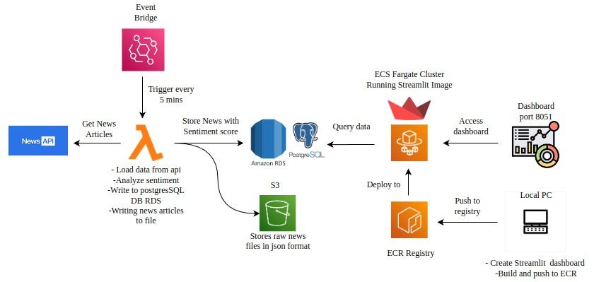

# 📰 News Sentiment Dashboard
## Overview
**News Sentiment Dashboard** is a project that collects news articles from the News API, stores them in AWS S3 and RDS, performs sentiment analysis on the article titles, and visualizes the results using a Streamlit dashboard. The entire application is containerized using Docker.The Dockerized Streamlit dashboard is pushed to **Amazon ECR (Elastic Container Registry)** as a container image. This image is then deployed and run on **Amazon ECS (Elastic Container Service)**. The application is accessible publicly via the ECS task's **public IP** on port **8501**(You can choose and expose any port)

## 💻 Technologies Used

- AWS Lambda  
- Amazon S3  
- Amazon RDS (PostgreSQL)  
- Streamlit  
- TextBlob  
- Docker  
- Amazon ECR  
- Amazon ECS  
- News API
  
## 🔁 Workflow
1. **Data Ingestion with AWS Lambda**
   - A Lambda function fetches news articles from the News API.
   - The raw data is stored in S3.
   - The same data is also inserted into a PostgreSQL table in Amazon RDS.
   - The RDS table is created programmatically within the Lambda function if it doesn't already exist.
2. **Sentiment Analysis & Dashboard**
   - A Streamlit app connects to the RDS database to read news data.
   - Sentiment analysis is applied to the `title` column using TextBlob.
   - A new `sentiment` column is added to the table with values: **positive**, **negative**, or **neutral**.
   - Each row is color-coded based on sentiment:
     - Positive: Blue
     - Negative: Red
     - Neutral: Green

3. **Deployment**
   - The Streamlit app is containerized using Docker.
   - The Docker image is pushed to Amazon ECR.
   - The image is then pulled and run on Amazon ECS.
   - The dashboard is accessible via the public IP and port `8051` of the ECS task (http://<'public-ip'>:8501)

## 🎨 Sentiment Visualization

| Sentiment | Color  |
|-----------|--------|
| Positive  | 🔵 Blue   |
| Negative  | 🔴 Red    |
| Neutral   | 🟢 Green  |

## 📂 Lambda Function

The Lambda function is available in [`lambda-rds.py`](./lambda-rds.py). It performs the following:

- Fetches news articles from the **News API**
- Stores raw JSON data in **Amazon S3**
- Creates a table in **Amazon RDS (PostgreSQL)** if it doesn’t exist
- Inserts news data into the RDS table

## 📊 Streamlit Dashboard

The Streamlit app is located in [`app.py`](./app.py). It performs the following tasks:

- Loads data from the **Amazon RDS (PostgreSQL)** news table
- Applies sentiment analysis on the **title** column using TextBlob
- Adds a new **sentiment** column in the RDS table to store sentiment labels
- Color-codes the sentiment column rows:  
  - Blue for **positive**  
  - Red for **negative**  
  - Green for **neutral**
- Displays an interactive dashboard visualizing news and their sentiments

## 🐳 Docker Configuration

The Docker setup files are included in the repo:

- [`Dockerfile`](./dockerfile) — defines the container image for the Streamlit app  
- [`requirements.txt`](./requirements.txt) — specifies the Python dependencies

## 🏗️ Project Architecture

## 🖼️ Output Preview

You can view the output screenshot here [streamlit_dashboard.png](./streamlit_dashboard.png)

## ✅ Conclusion

The **News Sentiment Dashboard** project demonstrates a complete end-to-end data pipeline using AWS services. It fetches real-time news articles from the News API, stores them in both S3 and RDS, performs sentiment analysis using TextBlob, and visualizes the results through a Streamlit dashboard. The entire solution is containerized with Docker, deployed using Amazon ECR and ECS, and made accessible via a public IP.

This project showcases how cloud-native tools, data engineering, natural language processing, and interactive dashboards can be integrated into a scalable and automated solution.

